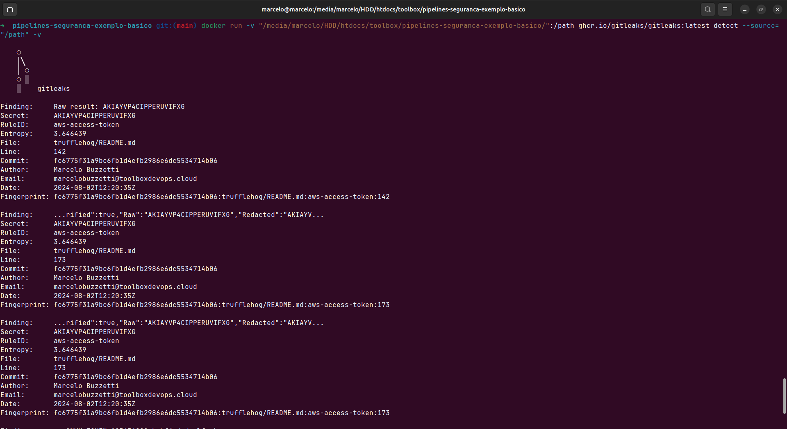
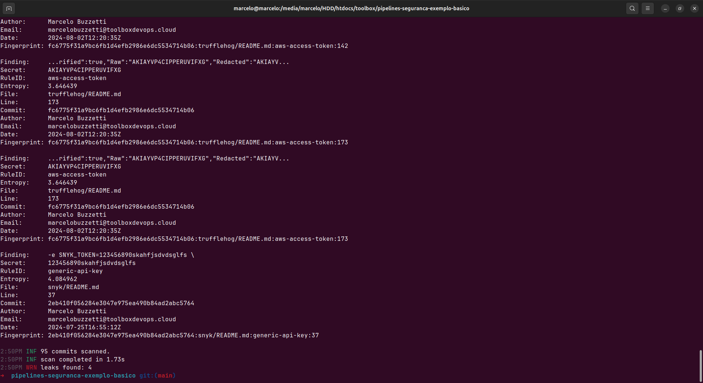
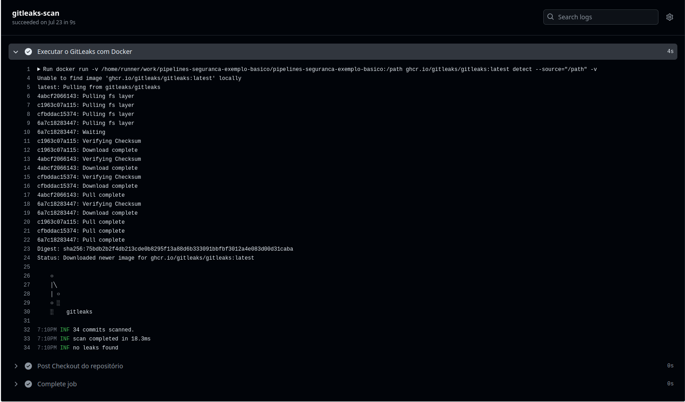

# Exemplos Básicos de GitLeaks


O [Gitleaks](https://github.com/gitleaks/gitleaks) é uma ferramenta SAST para detectar e prevenir segredos codificados, como senhas, chaves de API e tokens, em repositórios git. O Gitleaks é uma solução fácil de usar e completa para detectar segredos, passados ou presentes, no seu código.

## Instalação

### MacOS
```bash
brew install gitleaks
```

### Usando repositório DockerHub (certifique-se de ter o [Docker](https://docs.docker.com/get-docker/) instalado)
```bash
docker pull zricethezav/gitleaks:latest
docker run -v ${path_to_host_folder_to_scan}:/path zricethezav/gitleaks:latest [COMMAND] --source="/path" [OPTIONS]
```

### Usando repositório ghcr.io (certifique-se de ter o [Docker](https://docs.docker.com/get-docker/) instalado)
```bash
docker pull ghcr.io/gitleaks/gitleaks:latest
docker run -v ${path_to_host_folder_to_scan}:/path ghcr.io/gitleaks/gitleaks:latest [COMMAND] --source="/path" [OPTIONS]
```

### A partir do código-fonte (certifique-se de ter o [Go](https://go.dev/doc/install) instalado)
```bash
git clone https://github.com/gitleaks/gitleaks.git
cd gitleaks
make build
```

## Uso do GitLeaks

Existem dois comandos que você usará para detectar segredos: `detect` e `protect`.

### Detect

 O comando `detect` é usado para escanear repositórios, diretórios e arquivos. Este comando pode ser usado em máquinas de desenvolvedores e em ambientes de CI.

Ao executar `detect` em um repositório git, o gitleaks irá analisar a saída de um comando `git log -p` (você pode ver como isso é executado [aqui](https://github.com/zricethezav/gitleaks/blob/7240e16769b92d2a1b137c17d6bf9d55a8562899/git/git.go#L17-L25)). [`git log -p` gera patches](https://git-scm.com/docs/git-log#_generating_patch_text_with_p) que o gitleaks usará para detectar segredos. Você pode configurar sobre quais commits o `git log` irá variar usando a flag `--log-opts`. `--log-opts` aceita qualquer opção para `git log -p`. Por exemplo, se você quisesse executar o gitleaks em uma série de commits, você poderia usar o seguinte comando: `gitleaks detect --source . --log-opts="--all commitA..commitB"`. Veja a [documentação](https://git-scm.com/docs/git-log) do `git log` para mais informações.

Você pode escanear arquivos e diretórios usando a opção `--no-git`.

Se você quiser executar apenas regras específicas, você pode fazer isso usando a opção `--enable-rule` (com um ID de regra como parâmetro), esta flag pode ser usada várias vezes. Por exemplo: `--enable-rule=atlassian-api-token` aplicará apenas essa regra. Você pode encontrar uma lista de regras [aqui](https://github.com/gitleaks/gitleaks/blob/master/config/gitleaks.toml).

### Protect

 O comando `protect` é usado para escanear mudanças uncommitted em um repositório git. Este comando deve ser usado em máquinas de desenvolvedores de acordo com a [shifting left on security](https://cloud.google.com/architecture/devops/devops-tech-shifting-left-on-security). Ao executar `protect` em um repositório git, o gitleaks irá analisar a saída de um comando `git diff` (você pode ver como isso é executado [aqui](https://github.com/zricethezav/gitleaks/blob/7240e16769b92d2a1b137c17d6bf9d55a8562899/git/git.go#L48-L49)). Você pode definir a flag `--staged` para verificar mudanças em commits que foram adicionados ao git. A flag `--staged` deve ser usada ao executar o Gitleaks como um pré-commit.

 **NOTA**: O comando `protect` só pode ser usado em repositórios git, executar `protect`em arquivos ou diretórios resultará em uma mensagem de erro.

### Exemplo usando Docker com repositório ghcr.io

```bash
docker pull ghcr.io/gitleaks/gitleaks:latest
docker run -v "/caminho/para/seu/repositorio":/path ghcr.io/gitleaks/gitleaks:latest detect --source="/path" -v
```

**docker run**: Este é o comando principal para executar um contêiner Docker.

**-v "/caminho/para/seu/repositorio":/path**: Este é um argumento que especifica o mapeamento de volume entre o host e o contêiner Docker. Ele permite que o contêiner acesse o diretório do repositório que você deseja verificar.

**ghcr.io/gitleaks/gitleaks:latest**: Esta é a imagem Docker que será executada. Ela contém o Gitleaks e suas dependências.

**detect**: Este é um argumento específico do Gitleaks que instrui a ferramenta a executar a detecção de vazamentos de informações confidenciais.

**--source="/path"**: Este é outro argumento específico do Gitleaks que define o diretório de origem para a verificação. Neste caso, o diretório é definido como "/path", que é o diretório mapeado do host para o contêiner.

**-v**: Este é um argumento de verbosidade que instrui o Gitleaks a exibir informações detalhadas durante a execução.

Ao executar esse comando, o Docker irá baixar a imagem do Gitleaks, criar um contêiner a partir dessa imagem e executar a detecção de vazamentos de informações confidenciais no diretório do repositório especificado. O resultado da detecção será exibido no terminal.





Erros criados para fins didáticos.

### Uso do GitLeaks no Actions do GitHub

Para utilizar o GitLeaks no GitHub Actions, siga os passos abaixo:

1. Crie um arquivo de fluxo de trabalho (workflow) no seu repositório. Você pode criar um arquivo chamado [.github/workflows/gitleaks.yml](../.github/workflows/gitleaks.yaml) e adicionar o seguinte conteúdo:

```yaml
name: Security Check with GitLeaks
on:
  push:
    branches:
      - main
    paths:
      - 'gitleaks/python/**'  # Aciona o fluxo de trabalho quando houver alterações no diretório 'gitleaks/python'
  pull_request:
    branches:
      - main
    paths:
      - 'gitleaks/python/**'  # Aciona o fluxo de trabalho quando houver alterações no diretório 'gitleaks/python'
  workflow_dispatch:  # Aciona manualmente o fluxo de trabalho
    inputs:  # Define entradas para o fluxo de trabalho
      name:  # Define a entrada "name"
        description: 'Acionador manual do fluxo de trabalho'  # Descrição da entrada

jobs:
  gitleaks-scan:
    runs-on: ubuntu-latest  # Executa o trabalho na versão mais recente do Ubuntu

    steps:
      - name: Checkout do repositório  # Passo para fazer checkout do repositório
        uses: actions/checkout@v4 # Usa a ação 'actions/checkout' para fazer checkout do repositório
        with:
          fetch-depth: 0

      - name: Executar o GitLeaks com Docker  # Passo para executar o GitLeaks com Docker
        run: docker run -v ${{ github.workspace }}:/path ghcr.io/gitleaks/gitleaks:latest detect --source="/path" -v # Executa o GitLeaks com Docker no diretório de trabalho do repositório em que o GitHub Actions está sendo executado. 

```

2. Este arquivo de fluxo de trabalho executa o GitLeaks sempre que houver um push ou pull request na branch "main" do seu repositório alterando os arquivos presentes na pasta `gitleaks/python`. Você pode alterar o local a ser verificado.

3. Faça um commit e push do arquivo de fluxo de trabalho para o seu repositório. Você pode também disparar o flxo de trabalho manualmente.

4. O GitHub Actions executará automaticamente o fluxo de trabalho e o GitLeaks analisará os arquivos, fornecendo relatórios sobre possíveis problemas de segurança.

Com esses passos, você poderá utilizar o GitLeaks no GitHub Actions para verificar a segurança dos seu repositorio.

